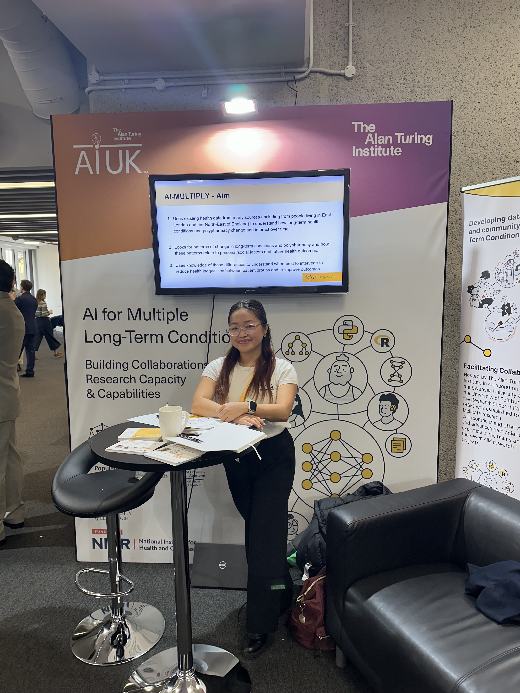

I represented the AI for Multiple Long-Term Conditions research programme at AI-UK 2024. I engaged with attendees at our stand, discussing the project and its goals, and shared insights about how AI is being applied to improve the understanding and management of multiple long-term health conditions.

[Event information](https://ai-uk.turing.ac.uk/programme/)

