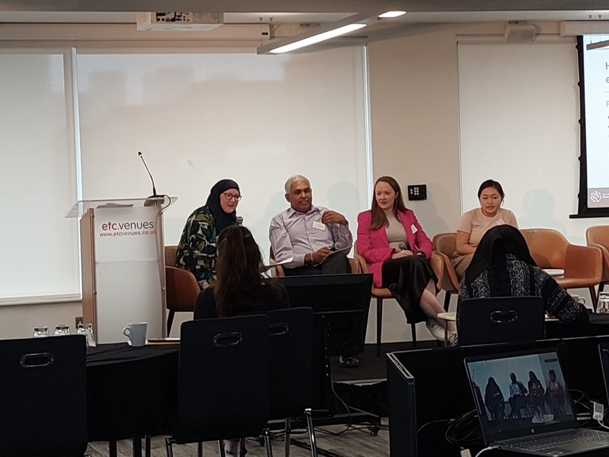
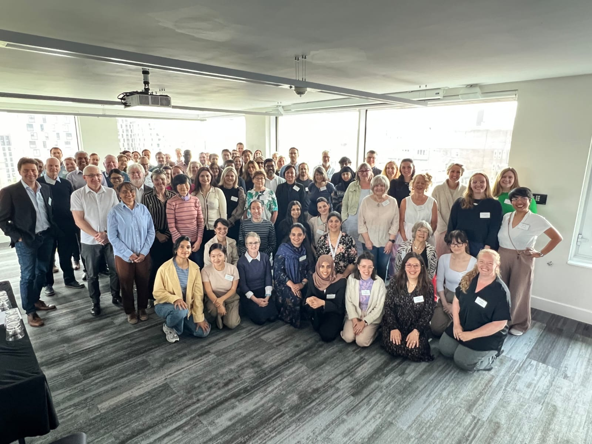

Topic: Building Trust for Meaningful Engagement. 

As a panel speaker, I shared insights on how early career researchers can build trust and foster meaningful Public and Patient Involvement (PPI) in research. I discussed what effective engagement looks like, the outcomes it can achieve, and how I’ve adapted my approach to make PPI more impactful and inclusive. My talk emphasized practical ways to strengthen researcher-participant collaboration for better research outcomes.

[Event information](https://www.turing.ac.uk/events/pioneering-ai-mltc-bridging-research-and-practice-conference-2024#:~:text=This%20Conference%20is%20an%20opportunity,work%2C%20and%20develop%20their%20skills.)

