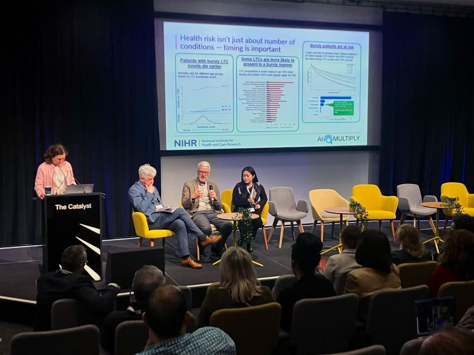

Presented research on modelling patient journeys using temporal and bursty event dynamics at an AI-Multiply public engagement event, highlighting how temporal patterns in patient records can provide insights into disease progression and outcomes, and discussing real-world implications with a multidisciplinary audience.

[Event information](https://ai-multiply.co.uk/uncategorized/patient-journeys-in-health-bringing-ai-along-for-the-ride/)

